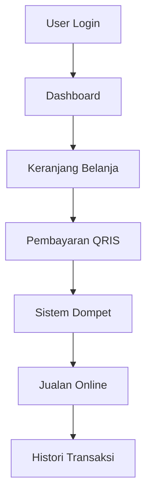
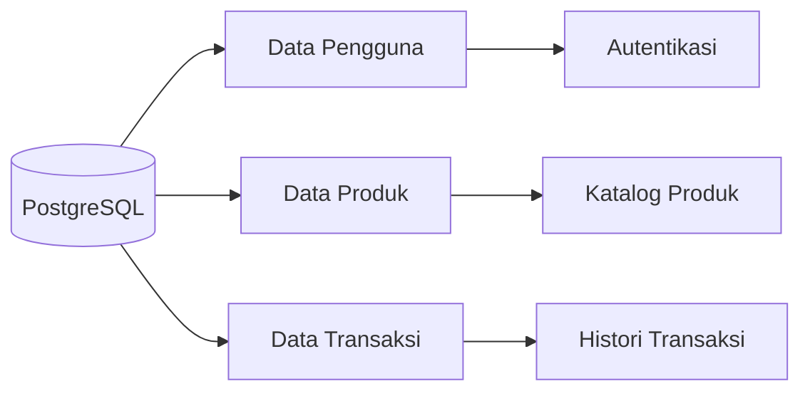
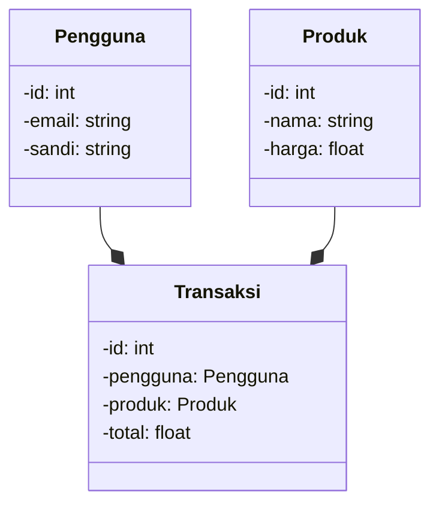

### 1. Executive Summary
Proyek "JajanWarung" adalah sebuah Fullstack Web App yang memiliki fitur pembayaran melalui QRIS secara otomatis, keranjang belanja, sistem dompet, dan sistem untuk jualan online. Platform teknologi ini akan berbentuk Aplikasi Web dengan metode otentikasi menggunakan Email/Sandi. Infrastruktur fitur prioritas yang krusial adalah Payment Gateway, dan arsitektur penyimpanan data akan menggunakan Relasional DB (PostgreSQL). Dengan demikian, teknologi yang dipilih harus mendukung integrasi pembayaran yang aman, basis data yang reliabel, dan antarmuka pengguna yang intuitif.

### 2. Visualisasi Sistem

### 3. Arsitektur Sistem & Spesifikasi Teknis
- **Frontend:** ReactJS karena kemampuan dalam mengembangkan antarmuka pengguna yang dinamis dan responsif.
- **Backend:** Node.js dengan Express.js untuk mengelola API dan integrasi dengan Payment Gateway.
- **Database:** PostgreSQL untuk penyimpanan data yang reliabel dan mendukung transaksi.
- **Payment Gateway:** Integrasi dengan gateway pembayaran yang mendukung QRIS untuk transaksi yang aman.
- **Autentikasi:** Menggunakan library seperti Passport.js untuk mengelola autentikasi email/sandi.

### 4. Vibecoding Plan
1. Buatlah struktur basis data PostgreSQL untuk menyimpan data pengguna, produk, dan transaksi, termasuk tabel untuk histori transaksi dan dompet pengguna.
2. Kembangkan fitur autentikasi menggunakan Passport.js dan Email/Sandi, pastikan untuk mengimplementasikan hashing dan salting yang aman untuk kata sandi.
3. Desain dan implementasikan antarmuka pengguna untuk keranjang belanja, pastikan untuk mengintegrasikan dengan basis data untuk menyimpan dan mengupdate produk yang dipilih pengguna.
4. Implementasikan fitur pembayaran menggunakan Payment Gateway yang dipilih, pastikan untuk mengikuti standar keamanan pembayaran dan mengintegrasikan dengan sistem dompet pengguna.
5. Buatlah API untuk mengelola transaksi, termasuk menambah, mengupdate, dan menghapus transaksi, serta mengembangkan fitur untuk menghitung total biaya dan mengupdate saldo dompet pengguna.
6. Kembangkan fitur jualan online yang memungkinkan pengguna untuk menambahkan produk ke katalog dan mengelola stok produk, pastikan untuk mengintegrasikan dengan basis data untuk menyimpan informasi produk.
7. Implementasikan fitur histori transaksi yang memungkinkan pengguna untuk melihat riwayat transaksi mereka, termasuk detail transaksi dan status pembayaran.