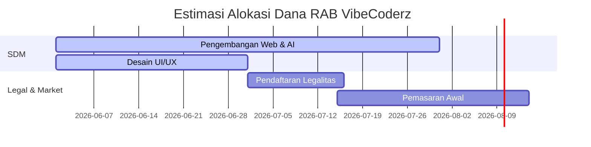

# Rencana Anggaran Biaya (RAB) & Harga Pokok Penjualan (HPP)
## Proyek: VibeCoderz AI Architecture Engine

Dokumen ini disusun untuk merencanakan aspek finansial platform SaaS **VibeCoderz**, yang mencakup estimasi biaya pengembangan awal (RAB) serta perhitungan biaya operasional langsung untuk melayani setiap pelanggan (HPP). Ini adalah bagian dari perencanaan bisnis digital untuk naik kelas dari tahap MVP (Minimum Viable Product) ke produk komersial yang berkelanjutan (*sustainable*).

---

## 1. Asumsi Dasar Proyek
Sebelum menyusun RAB dan HPP, berikut adalah asumsi operasional dan teknis yang digunakan:
1. **Model Bisnis**: SaaS (*Software as a Service*) dengan model *Freemium* (Paket Gratis, Starter/Pro, dan Pro Max/Premium).
2. **Infrastruktur Cloud**: Hosting berbasis serverless/VPS, database terkelola (managed database), dan integrasi API LLM (Groq Llama 3.3 70B & DeepSeek V4).
3. **Metode Transaksi**: Menggunakan Payment Gateway lokal (seperti Midtrans) dengan biaya per transaksi flat/persentase.
4. **Volume Awal**: Menargetkan akuisisi awal 100 pengguna aktif bulanan pada fase awal peluncuran komersial.

---

## 2. Rencana Anggaran Biaya (RAB) Pengembangan & Peluncuran
RAB ini mencakup biaya satu kali (*one-time cost*) untuk mengembangkan platform dari MVP menjadi produk komersial siap pakai, serta biaya operasional awal selama 3 bulan pertama.

### A. Biaya Pengembangan Aplikasi & AI (Human Resource)
| No | Komponen Pekerjaan | Deskripsi | Durasi | Estimasi Biaya |
| :--- | :--- | :--- | :--- | :--- |
| 1 | **Full-Stack Developer** | Implementasi frontend (React, Sandpack), backend (Node.js/Prisma), dan integrasi API. | 2 Bulan | Rp 15.000.000 |
| 2 | **UI/UX Designer** | Perancangan arsitektur informasi, Bento Grid UI, dan kustomisasi aset desain premium. | 1 Bulan | Rp 5.000.000 |
| 3 | **AI/Prompt Engineer** | Desain system prompt, tuning failover API, benchmarking akurasi model, dan optimasi token. | 1 Bulan | Rp 6.000.000 |
| **Subtotal A** | | | | **Rp 26.000.000** |

### B. Biaya Infrastruktur & Tools (Awal - 3 Bulan)
| No | Komponen Alat / Layanan | Deskripsi | Kuantitas | Estimasi Biaya |
| :--- | :--- | :--- | :--- | :--- |
| 1 | **Domain (.com / .id)** | Registrasi domain utama untuk brand identity. | 1 Tahun | Rp 150.000 |
| 2 | **VPS / Cloud Hosting (Vercel/DO)** | Server backend & deployment frontend. | 3 Bulan | Rp 900.000 |
| 3 | **Database Terkelola (Supabase/Neon)** | Penyimpanan database relasional untuk user & blueprint. | 3 Bulan | Rp 750.000 |
| 4 | **Saldo Awal API LLM** | Deposit awal Groq API & DeepSeek API untuk testing & launch. | Lump-sum | Rp 1.500.000 |
| **Subtotal B** | | | | **Rp 3.300.000** |

### C. Biaya Legalitas & Pemasaran (Fase Komersialisasi)
| No | Komponen | Keterangan | Kuantitas | Estimasi Biaya |
| :--- | :--- | :--- | :--- | :--- |
| 1 | **Pendirian PT Perorangan** | Pembuatan akta pendirian, SK Kemenkumham, & pendaftaran NIB. | Sekali Bayar | Rp 1.500.000 |
| 2 | **Pendaftaran PSE Kominfo** | Pengurusan izin pendaftaran platform digital komersial. | Jasa/Mandiri | Rp 500.000 |
| 3 | **Pendaftaran HAKI Merek** | Perlindungan hukum nama dan logo "VibeCoderz". | Kelas Usaha | Rp 2.500.000 |
| 4 | **Pemasaran Digital & Konten** | Iklan berbayar (Meta Ads/Google Ads) untuk akuisisi awal. | Lump-sum | Rp 3.000.000 |
| **Subtotal C** | | | | **Rp 7.500.000** |

### D. Rekapitulasi Total RAB

* **Subtotal A (Sumber Daya Manusia)**: Rp 26.000.000
* **Subtotal B (Infrastruktur & Tools)**: Rp 3.300.000
* **Subtotal C (Legal & Pemasaran)**: Rp 7.500.000
* **Dana Darurat / Cadangan (5%)**: Rp 1.840.000
* **TOTAL KEBUTUHAN RAB**: **Rp 38.640.000**

---

## 3. Analisis Harga Pokok Penjualan (HPP) per Langganan
HPP (atau *Cost of Goods Sold* - COGS) untuk bisnis SaaS adalah biaya langsung yang dikeluarkan untuk melayani satu akun pelanggan aktif per bulannya. Komponen biaya langsung ini meliputi:
1. **Biaya API LLM (Tokens)**: Biaya Groq / DeepSeek per query pembuatan PRD & Code.
2. **Biaya Compute / Bandwidth**: Resources server untuk mengeksekusi Sandpack & render visual.
3. **Biaya Payment Gateway**: Tarif tetap per transaksi pembayaran sukses.

### A. Asumsi Biaya Teknis & API
* **Harga Groq (Llama 3.3 70B)**: $0.59 / juta input token, $0.79 / juta output token. (Rata-rata: Rp 10 / 1.000 token).
* **Harga DeepSeek API (V3/V4)**: $0.14 / juta input token, $0.28 / juta output token. (Rata-rata: Rp 3 / 1.000 token).
* **Konsumsi Token rata-rata per PRD**:
  * Input (Prompt & Context): 15.000 token = Rp 150 (Groq) atau Rp 45 (DeepSeek).
  * Output (Full Markdown & Diagram): 10.000 token = Rp 120 (Groq) atau Rp 45 (DeepSeek).
  * *Rata-rata biaya API per PRD Generation*: **Rp 270 (Groq)** atau **Rp 90 (DeepSeek)**. Kita gunakan angka konservatif **Rp 200 / generate**.
* **Biaya Serverless Compute & Database**: Dialokasikan flat **Rp 1.000 / user aktif / bulan**.
* **Biaya Transaksi Payment Gateway (Midtrans)**: Rata-rata flat **Rp 4.000 / transaksi** (Bank Transfer/Virtual Account).

---

### B. Perhitungan HPP per Tingkat Keanggotaan (Subscription Plan)

Berikut adalah pembagian HPP per plan bulanan:

#### 1. Paket TRIAL (Free - Rp 0/bulan)
* **Batas Harian**: Maksimal 1x PRD per hari (Estimasi rata-rata penggunaan riil: 10x PRD / bulan).
* **Perhitungan Biaya**:
  * API LLM: 10 generate x Rp 200 = Rp 2.000
  * Serverless Hosting & DB: Rp 1.000
  * Fee Payment Gateway: Rp 0 (tidak ada transaksi)
* **Total HPP Paket Free**: **Rp 3.000 / user / bulan**  
  > *Catatan: Paket ini disubsidi penuh oleh pengguna paket berbayar.*

#### 2. Paket STARTER (Pro - Rp 20.000/bulan)
* **Batas Harian**: Maksimal 5x PRD per hari, maks 20 chat revisi. (Estimasi rata-rata penggunaan riil: 40x PRD + chat / bulan).
* **Perhitungan Biaya**:
  * API LLM: 40 generate/chat x Rp 200 = Rp 8.000
  * Serverless Hosting & DB: Rp 1.000
  * Fee Payment Gateway (Midtrans): Rp 4.000
* **Total HPP Paket Starter**: **Rp 13.000 / user / bulan**
* **Gross Profit**: Rp 20.000 - Rp 13.000 = **Rp 7.000**
* **Gross Margin**: **35.0%**

#### 3. Paket PRO (Pro Max - Rp 75.000/bulan)
* **Batas Harian**: Unlimited PRD (Fair Usage Policy - FUP 200x generate + 200 chat revisi). (Estimasi rata-rata penggunaan riil: 120x PRD + chat / bulan).
* **Perhitungan Biaya**:
  * API LLM: 120 generate/chat x Rp 200 = Rp 24.000
  * Serverless Hosting & DB: Rp 2.000 (alokasi resources lebih tinggi)
  * Fee Payment Gateway (Midtrans): Rp 4.000
  * Hosting & Hak Akses Bonus Kursus VibeCoding: Rp 2.000
* **Total HPP Paket Pro**: **Rp 32.000 / user / bulan**
* **Gross Profit**: Rp 75.000 - Rp 32.000 = **Rp 43.000**
* **Gross Margin**: **57.3%**

---

## 4. Matriks Ringkasan HPP & Margin
Berikut adalah tabel perbandingan harga jual, HPP, margin kotor, dan rasio margin kotor untuk setiap plan VibeCoderz:

| Plan | Harga Jual (Bulanan) | HPP (Direct Cost) | Gross Profit (Laba Kotor) | Gross Margin (%) | Keterangan |
| :--- | :--- | :--- | :--- | :--- | :--- |
| **Trial (Free)** | Rp 0 | Rp 3.000 | -Rp 3.000 | - | Ditanggung subsidi silang |
| **Starter (Pro)** | Rp 20.000 | Rp 13.000 | Rp 7.000 | 35.0% | Margin sedang, untuk penetrasi pasar |
| **Pro (Pro Max)** | Rp 75.000 | Rp 32.000 | Rp 43.000 | 57.3% | Margin tinggi, profit driver utama |

---

## 5. Analisis Titik Impas (Break-Even Point - BEP)
Untuk menutup biaya tetap bulanan operasional minimal (Hosting Serverless, Database Premium, Lisensi Domain, Maintenance Mandiri) sebesar **Rp 500.000 / bulan**, berikut target pelanggan berbayar minimum yang harus dicapai:

### Skenario Campuran Pelanggan (Target Awal):
Jika diasumsikan rasio pelanggan berbayar adalah **70% Starter** dan **30% Pro**:
* Pendapatan rata-rata per pengguna berbayar (*Average Revenue Per Paying User - ARPPU*):  
  $\text{ARPPU} = (0.7 \times \text{Rp } 20.000) + (0.3 \times \text{Rp } 75.000) = \text{Rp } 36.500$
* Rata-rata HPP per pengguna berbayar:  
  $\text{Rata-rata HPP} = (0.7 \times \text{Rp } 13.000) + (0.3 \times \text{Rp } 32.000) = \text{Rp } 18.700$
* Kontribusi Margin Kotor per pengguna berbayar:  
  $\text{Margin} = \text{Rp } 36.500 - \text{Rp } 18.700 = \text{Rp } 17.800$

$$\text{BEP Pelanggan Berbayar} = \frac{\text{Biaya Tetap Bulanan}}{\text{Kontribusi Margin Bulanan}} = \frac{\text{Rp } 500.000}{\text{Rp } 17.800} \approx \mathbf{28\text{ Pelanggan}}$$

**Kesimpulan BEP**: VibeCoderz harus mengakuisisi minimal **28 pelanggan berbayar** (sekitar 20 paket Starter dan 8 paket Pro) untuk dapat menutup seluruh biaya operasional bulanan mandiri (*self-sustaining*).

---

## 6. Rekomendasi Optimasi Keuangan
Untuk meningkatkan profit margin dan menurunkan HPP VibeCoderz, langkah-balik teknis berikut disarankan:
1. **Caching PRD**: Menyimpan hasil PRD yang mirip dalam database vector. Jika ada user meminta PRD dengan kriteria yang sama, panggil dari database cache, bukan memicu API LLM berbayar kembali.
2. **Model Router**: Menggunakan model yang lebih murah (misalnya DeepSeek Flash) untuk revisi chat sederhana atau PRD draf awal, dan hanya menggunakan model mahal (Groq Llama 3.3 / DeepSeek Pro) untuk kompilasi kode dan dokumen arsitektur final.
3. **Optimasi Prompt**: Membatasi output token LLM yang tidak perlu dalam system prompt agar hemat biaya per API call.
4. **Volume Discount**: Beralih ke skema kontrak API berbayar berbasis kuota tahunan jika volume traffic telah stabil untuk mendapatkan diskon hingga 30%.
