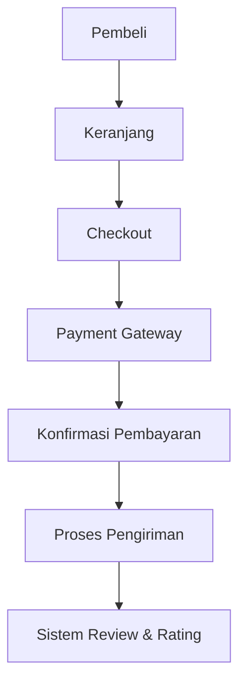
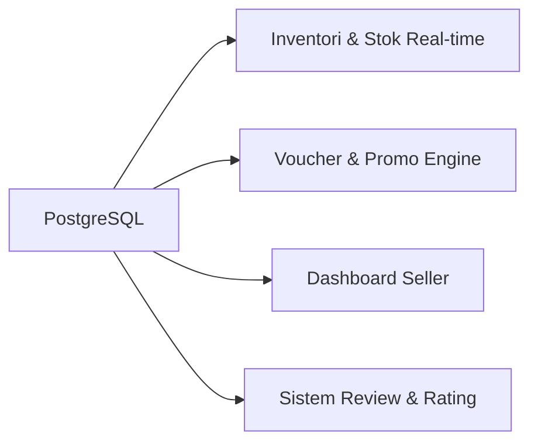
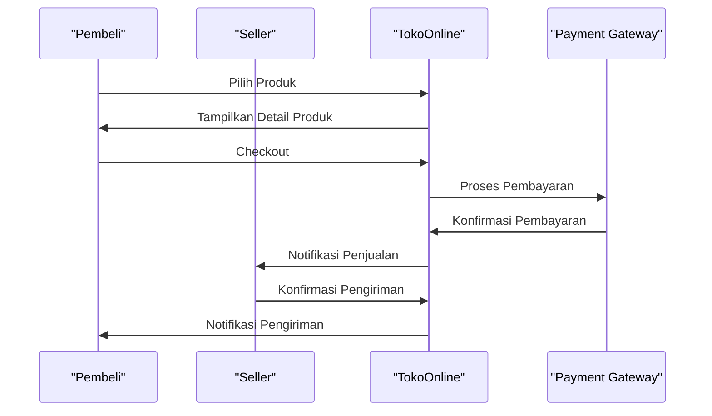

### Executive Summary
TokoOnline adalah proyek Fullstack Web App yang bertujuan untuk membangun sebuah marketplace dengan fitur lengkap, termasuk payment gateway, inventori & stok real-time, voucher & promo engine, dashboard seller, sistem review & rating, keranjang & checkout, dan kurir / ongkir integration. Proyek ini akan menggunakan teknologi open-source untuk membangun aplikasi web yang skalabel dan efisien. 

### Visualisasi Sistem

### Arsitektur Sistem & Spesifikasi Teknis
- Frontend: React.js dengan library Material-UI untuk membangun antarmuka pengguna yang responsif dan mudah digunakan.
- Backend: Node.js dengan framework Express.js untuk membangun API yang skalabel dan efisien.
- Database: PostgreSQL sebagai sistem manajemen basis data relasional untuk menyimpan data produk, transaksi, dan informasi pengguna.
- Payment Gateway: Midtrans atau Stripe untuk memproses pembayaran secara aman dan efisien.
- Integrasi: API untuk mengintegrasikan dengan kurir / ongkir integration dan sistem review & rating.

### Vibecoding Plan
1. Buatlah komponen React.js untuk menampilkan daftar produk dengan filtering dan sorting.
2. Implementasikan API menggunakan Express.js untuk mengambil data produk dari database PostgreSQL.
3. Buatlah sistem autentikasi pengguna menggunakan JSON Web Token (JWT) untuk memproteksi API.
4. Implementasikan payment gateway Midtrans atau Stripe untuk memproses pembayaran.
5. Buatlah dashboard seller untuk memantau penjualan dan mengelola produk.
6. Implementasikan sistem review & rating untuk memungkinkan pembeli meninggalkan ulasan produk.
7. Buatlah API untuk mengintegrasikan dengan kurir / ongkir integration untuk memproses pengiriman produk.